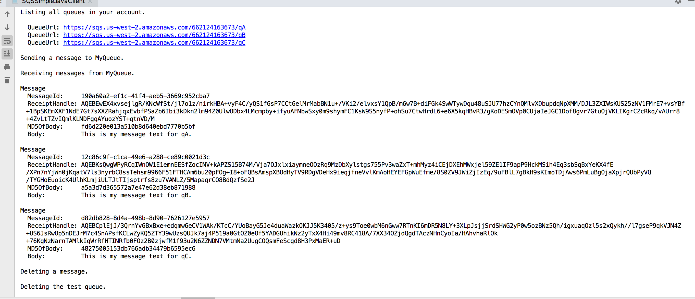

## sqs

This app will create 3 queues: qA,qB,qC

And all queues will receive/delete messages.

After that will delete the messages and delete the queues

## How to test it

You will see the message body in the console.

## Displaying messages in console

